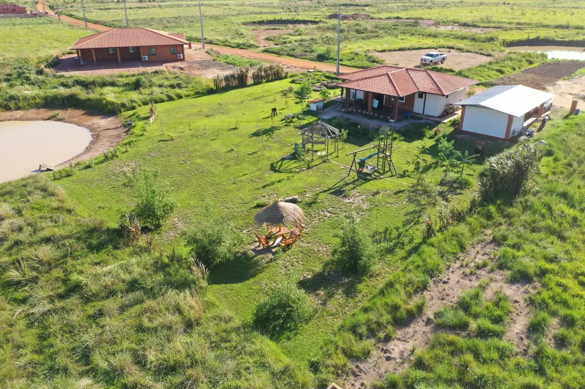
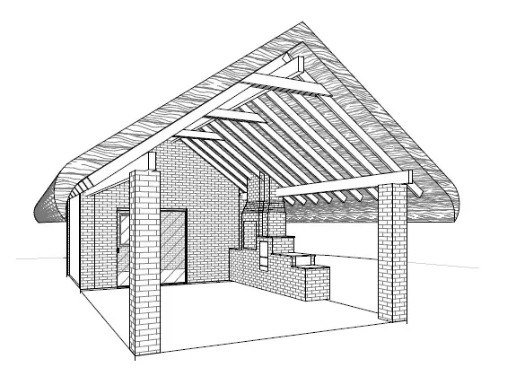

+++
title = 'Many progressions on our property in Paraguay'
summary = 'Here’s a brief summary of everything I built for us last year. The biggest project was undoubtedly our kitchen. There were numerous details to take into account, and we can already use the kitchen, but it’s not yet completely finished.'
date = 2022-05-07T12:32:00-03:00
lastmod = 2022-05-07T12:32:00-03:00

tags = ['El Paraiso Verde', 'Quincho', 'Pain Therapy', 'Woodworking Workshop', 'Kitchen', 'Emigrate', 'Garden']
categories = ['Paraguay']

showComments = true
chatId = "progressonourproperty"

[translation]
  tool = "md-translator"
  version = "1.2.3"
  from = "de"
  to = "en"
  date = 2026-06-21
  time = "19:06:00"
+++

It’s been a long time since my last blog post. To be precise, another whole year
has passed. How quickly time flies! It seems I never found the time to write.
Nevertheless, a lot has happened, and we’ve made significant progress on our
property. I’d like to give you a brief update today. Probably I can’t cover
everything, and the information might not be completely up-to-date.

I keep posting smaller updates from time to time on:

- [Instagram](https://www.instagram.com/sebastianzehner/)
- [Facebook](https://www.facebook.com/sebastianzehner83/)

If you’d like to follow along with that, you’ll find me there. I’m actually
surprised by all the things we’ve accomplished over the past year. It’s hard to
really notice the changes—that is, to fully grasp them when you’re right in the
midst of the events. Anyway, my woodworking shop is now finished and partially
furnished, which brings me back to my last blog post.

Why only partially completed? I had other priorities when it came to building
the furniture for our house; therefore, I haven’t made any cabinets for my
workshop yet. I spend a lot of time outside my workshop, where I carry out the
main part of my work.

It’s really fun to work outdoors, under the carport – it’s
very pleasant there. Of course, I don’t always have the time to build all the
furniture, because I also help many people with their relocation processes and
help them prepare for their new lives. It’s a great task, and I’m happy for
everyone who manages to make it and finds happiness in our community.

## What have I built for us over the past year?

Here’s a brief summary of everything I built for us last year. The biggest
project was our kitchen. There were many details to take care of, and we can
already use the kitchen, but it’s not completely finished yet; three drawers and
all the cabinet fronts are still missing. For those parts, I want to create
something really beautiful, so I need to invest the necessary time and patience.
For now, the kitchen is still functional. We have a temporary wooden worktop;
probably we’ll end up getting a suitable stone worktop as well.

Next, I started working on our wardrobe. Once again, the drawers and the fronts
are still missing… But as they say in Paraguay, “tranquilo” (meaning “calmly” or
“patiently”). Eventually, I will get to it and finish installing those parts
too. Often, other people receive more of my attention than we give to ourselves.
As long as our basic needs are met, that’s perfectly fine.

Meanwhile, I’ve continued working on our washbasins. They could actually be
finished already if the stone slabs had been installed. The problem right now is
finding someone to do that. I’m considering making the slabs from glued wood
panels myself and then installing a nice wooden top for the washbasins. Well,
that’s not yet a final decision; I need to give it a try first. By the way, I
bought a heavy-duty planer that I can use for this task.

I also built some shelves for our storage room. The children finally got their
bunk bed, which comes with a nice platform and a comfortable ladder. Their
wardrobe was completed using parts from someone else’s project; it turned out
very nicely, and they’re going to receive some doors donated for it later on.

I built a desk for myself, and that’s probably one of the reasons why I’m
writing another new blog post now. It’s just more comfortable to write while
sitting down. Otherwise, I mainly used my laptop at the standing desk for Skype
calls; having conversations while standing is also quite pleasant.

Our children wanted their own playground. Of course, that means the dad has to
build it too. First, I needed to figure out where I could obtain all the
necessary materials in Paraguay. I found a nice contact person through whom I
was able to buy everything in one go, even including the construction plans, and
then I got to work on this new project.

The children obviously found the playground more important than the bunk bed, so
I put off building the bunk bed and focused on constructing the playground
first. Our neighbor even helped us with the concreting. It’s a great playground
with a play tower, a slide, two swings, and a flexible climbing ladder. We’ll
see what else can be added in the future. I’d like to build a “Ninja Warrior
Parkour” area at some point; that would also be a fun space for us adults to
use. I already have some ideas for that in my head.

For the outdoor area, I also built a planting table with a shelf, as well as a
support structure for our rose bush. I did all this bit by bit, in my spare
time; it’s only by taking things one step at a time that you can achieve your
goal. Take a look at these few pictures to see the process in action:



## What’s going on in our garden?

We regularly mowed our yard, and over time it turned green on its own. We didn’t
plant any grass seeds or even use any pre-made turf. It’s quite impressive just
to let nature take its course; with a little patience, it becomes a breeze to
maintain. We’ve planted new trees several times, and even the area in front of
the house is ready for growth. Eventually, our house will be almost impossible
to see from the road.

Let’s see what happens this winter; I hope nothing freezes or breaks down. It
already looks really nice, and all the plants grew in just a few months. The
growth really started in the spring, and once it rains properly, the trees
experience a surge in growth.

We built some raised beds using stones, and now we have tomatoes, chilies,
peppers, cucumbers, and more growing there. The first successes in food
production have already been achieved. In the coming time, we will try even more
things and make further improvements. It’s a lot of work, and we do everything
ourselves.

Just keep trying again and again, see how things work, and learn from that
process. Unfortunately, we weren’t taught this when we were kids, so we have to
learn everything from scratch now. It’s a truly exciting adventure, and our
children have been part of it from the very beginning. It’s like a paradise –
having the opportunity to grow almost anything imaginable.



## What is next planned for us?

Next, we’ll build our quincho (an outdoor shelter or pavilion). The planning and
cost estimation have been completed; I’ve already signed all the necessary
documents, so construction could begin soon. This will result in a beautiful
outdoor kitchen with a wooden grill, a wood-burning stove, and a wooden
fireplace. There will also be a large, rustic wooden table with benches, where
we can spend pleasant time with our loved ones.

In addition, we have planned a space for Stefanie where she will be able to
provide her treatments (massages and pain therapy). Unfortunately, she no longer
has a room available at our settlement; there are just too many of us now and no
free spaces left. All the apartments and Newtel rooms are usually occupied. So,
this separate room on our property is necessary – perhaps we won’t even need to
leave our property anymore.

This should suffice as an initial update for now. I’ll be writing another blog
post shortly; it will cover my latest interview regarding immigration and life
in Paraguay, specifically within a gated community. What are the challenges
involved, and how do we feel living in [El Paraiso Verde](https://paraiso-verde.com/)?

I will also link to my video from that flight in the post. It was in early March
2022; we started from the airport in Caazapa and flew for about 20 minutes to
our settlement, then back again. That was also a great experience for us.

Best regards,  
Sebastian


