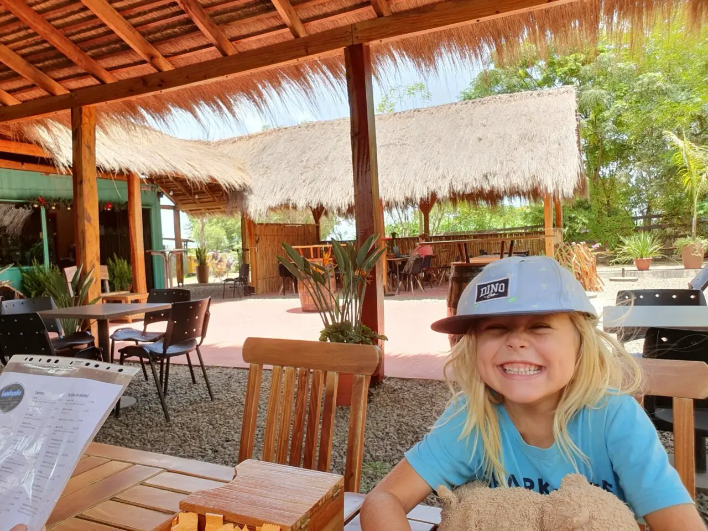
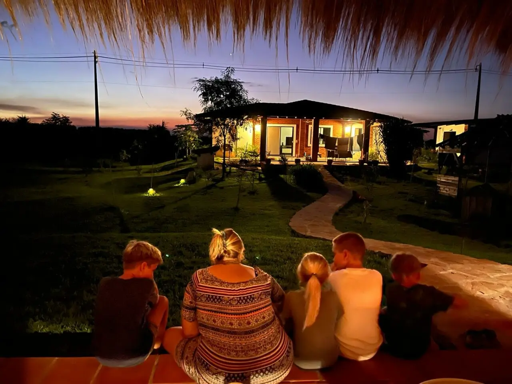

+++
title = 'Move to Paraguay: The impending financial crisis'
summary = 'We’re doing extremely well here. We have summer temperatures in Paraguay that make swimming irresistible. Just recently, we had a heavy rainstorm, which has made our property in Paraguay even greener.'
date = 2023-03-26T18:39:41-03:00
lastmod = 2023-03-26T18:39:41-03:00

tags = ['El Paraiso Verde', 'Emigration', 'Finance']
categories = ['Paraguay']

showComments = true
chatId = "movetoparaguayfinancialcrisis"

[translation]
  tool = "md-translator"
  version = "1.2.3"
  from = "de"
  to = "en"
  date = 2026-06-21
  time = "19:06:00"
+++

## What chances do we still have?

We’re doing very well here. In Paraguay, the temperatures are summer-like, which
makes swimming an enjoyable activity. We just had a heavy rainstorm, and it has
made our property in El Paraiso Verde even greener.

We tend to easily forget what’s going on in the outside world. We’ve forgotten
our concerns about the banking system, since we managed to save all our wealth
in time, well over four years ago, before Europe went into chaos. For more than
two years now, we’ve been living in our own house on this property, planting
trees, and taking care of our growing vegetable garden.

Some of our neighbors even built one or three additional apartments on their
properties and now live comfortably off the rent income from all the units in
their complexes, which are 100% rented out. Having both a house and apartments
as sources of income—what more could one possibly want?

I don’t want to address all the negative headlines in the media with my blog
post, because I prefer to think positively. After all, this is also my blog, and
I aim to highlight the positive and happy aspects of life. Only in this way can
we look forward to the future with peace of mind.

We don’t need to worry about what will happen in three to five years. We’re
secure and live in a wonderful community where we support each other. We have
almost no overhead costs, as we live in our own house on our own land without
any loans; we pay for everything out of our own pocket. Therefore, there’s no
pressure to pay monthly mortgage payments to a bank.

Most of our money is spent on food, and we earn it through online work, as well
as here in Paraguay. We’re always trying to grow more of our own crops to become
more independent in that area as well. It’s important for us to have the option
to work, but not to feel like we have to. If we want to take a break, we do; and
if we want to go somewhere, we just go.

## Emigrating to Paraguay: A Gated Community

In the past few years, I’ve participated in numerous Skype conversations. During
these conversations, I helped immigrants from Germany, Austria, Switzerland, and
the United States to move to Paraguay. I really enjoyed doing this, and I’m even
more delighted when they, just like us, are able to build a happy future within
our safe community.

Unfortunately, I also had to witness some sad stories in this process. It really
took a lot of energy from me. Not always does immigration go as planned;
sometimes family members disagree, the necessary funds are not available, or
people simply lack the courage to pursue it. Everyone who makes it to us should
be considered very lucky. Sometimes these situations touch me so deeply that I
need a short break to regain my strength.

Fortunately, this works particularly well on our property. You just need to take
a look at the garden to feel the energy immediately. What has changed over the
past two years on our property, as well as in our entire residential area, is
incredible. I am very happy and grateful for that.

## The real estate market in Europe is declining

Unfortunately, I’ve repeatedly noticed that in Germany, it’s becoming much
harder to sell a property at the desired price over time. Since mid-2020, the
real estate market has been on the decline; many people are now only able to
sell their properties for significantly lower prices than the peak market
levels.

We were able to sell our property at a top price by the end of 2018 and
immediately transferred our capital to Paraguay. A huge thank you to our
wonderful real estate agents [“The Hausers”](https://die-hausers.de/)! They
presented our property extremely well and managed to sell it for a higher price
than we had hoped for in a very short amount of time.

Today, things probably wouldn’t be quite so easy, and we would have had to make
some compromises. Fortunately, our funds arrived in Paraguay quickly and were
waiting for us to get there. We didn’t arrive until November 2019 because we
took a [Long journey by camper](/categories/roadtrip/) as a farewell tour
across Europe first.

At the beginning of 2020, we were able to start building our house in Paraguay.
The further details of the process I have documented on my blog from
[here](/categories/paraguay/).

Another issue is the looming financial crisis—or has it already arrived? How
safe is the money in our bank accounts? Not long ago, there were reports about
the Silicon Valley Bank, and that’s no small bank; it was closed down due to
insolvency. Subsequently, European banks also suffered significant losses in
just one day. How can we protect our bank savings?

## Stable capital investment in uncertain times

We have several options for how to participate in the world’s largest “Plan B”
project, which represents the solution to the current crises. Six years of
intensive work have gone into its development, and precisely at this moment, we
have the solutions needed to protect the assets of vulnerable banks.

1. Smooth transfer to Paraguay.
2. Securing the property by owning a piece of land in our residential area.
   (A valuable property)
3. Flexibility in the use of assets within the
   Settlement project for example:
   - Your own piece of land with your own house, or a backup house (which can be rented out if needed)...
     …or as long as you don’t yet live with us.
   - Apartments: We just recently received 22 requests from people who wanted to stay there.
     We are looking for a long-term rental property.
   - **Arrangements in the economic operations of our settlement:** Diversification in…
     Various types of income sources, ranging from agriculture and livestock farming to cutting-edge technologies (new energy generation, 3D printing for houses, houses and bricks made from compressed soil, etc.).

In this context, returns of up to 8-12% per year are achieved; many people even obtain inflation-protected returns by renting out apartments and houses.

You’re probably wondering how to save your savings as well from the potential collapse of the banking system. Please watch the following video and then fill out the contact form to obtain more information. The link is located below the video. We will communicate with you personally.



The contact form for El Paraiso Verde can be found at [here](https://paraiso-verde.com/kontakt).

If you have any further questions, you can also feel free to contact me, and I would be happy to share with you our personal experiences. After all, we have been living happily in Paraguay, in El Paraiso Verde, since 2019.

You can also just start by subscribing to the newsletter from El Paraiso Verde at [here](https://paraiso-verde.com/newsletter-eintragen/).

A property in our residential area, for your own use or to rent out, will protect your capital and offer returns on rental income that are several times higher than the usual, inflation-protected rates seen in Europe. We have taken the same precautions, and our children will thank us for it today – and in the future as well.

For everyone who _hasn’t yet thought about moving abroad_, building small houses in our residential area is an excellent investment. It also serves as a safe place to live in case the world outside becomes unsafe and uninhabitable.

We are very happy that we no longer have to worry about anything. We finished our homework on time and can now fully enjoy our lives today. You will hear from me or see me again soon; I am planning to make a new update video about the construction of our house in Paraguay.

Once again, something has changed on our property. Stay tuned for the next blog post! Until then, and who knows… maybe we’ll see each other soon in Paraguay, and I can show you our property in person.

Best regards,  
Sebastian

PS: Read more about me in [Profile](about).


