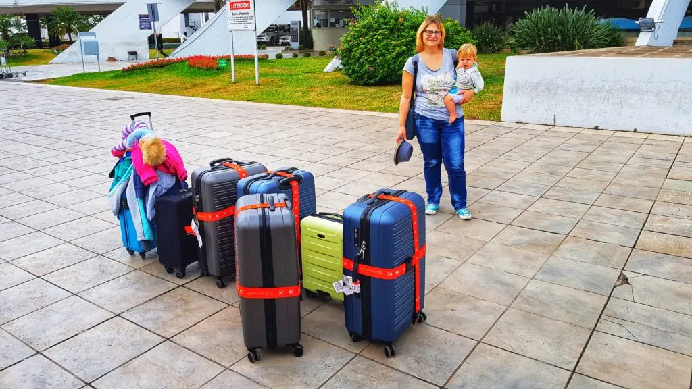
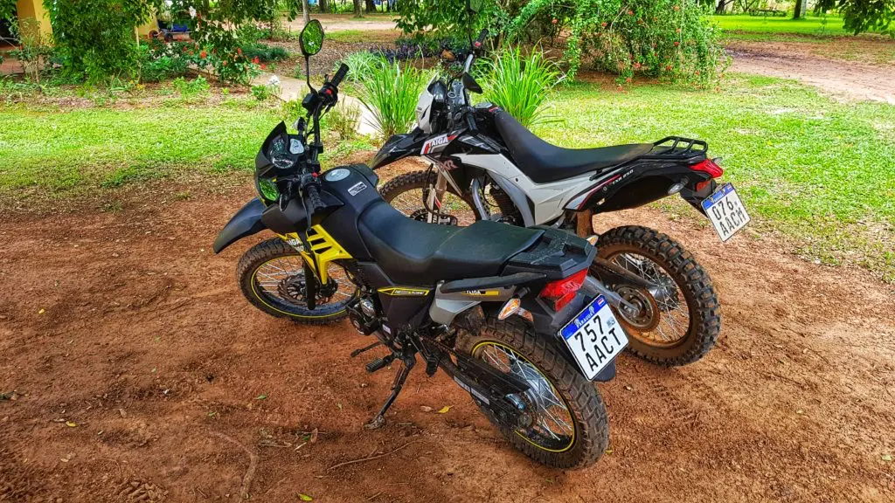

+++
title = 'Traslado a Paraguay'
summary = 'Nos registramos para dejar Alemania el 06 de noviembre de 2019 y nos mudamos a Paraguay. Ahora llevamos viviendo aquí casi un mes, y poco a poco nos estamos adaptando.'
date = 2019-12-06T19:07:01-03:00
lastmod = 2019-12-06T19:07:01-03:00

tags = ['El Paraíso Verde', 'Una vida sencilla', 'Emigrar']
categories = ['Paraguay']

showComments = true
chatId = "move-to-paraguay"

[translation]
  tool = "md-translator"
  version = "1.2.3"
  from = "de"
  to = "es"
  date = 2026-06-21
  time = "19:06:00"
+++

Nos registramos como residentes fuera de Alemania el 6 de noviembre de 2019 y
nos mudamos a Paraguay. Ahora llevamos viviendo aquí casi un mes y, poco a poco,
hemos logrado adaptarnos.

Tras nuestro largo [viaje en autocaravana por España y Portugal][1], tuvimos
algunos problemas en Alemania hasta que terminamos de resolver todos los asuntos
pendientes; luego vino el largo vuelo hacia Sudamérica. Hoy me gustaría contarte
un poco sobre ello.

La idea de ir a Sudamérica, más concretamente a Paraguay, surgió a mediados de 2017. En realidad, solo queríamos comprobar si tal opción era viable para
nosotros; si lo fuera, primero nos propondríamos establecer una segunda base y,
quizás, emigrar en cinco años. A finales de 2017, preparamos todo para nuestro
primer viaje a Paraguay.

## El primer viaje a Paraguay

En marzo de 2018 llegó el momento: viajamos por primera vez con nuestra hija de
un año a una distancia tan larga. Desde Fráncfort a Madrid, y desde Madrid a
Asunción; el trayecto en sí dura ya 16 horas.

Teníamos ciertas ideas sobre Paraguay y queríamos comprobar en el lugar cómo
coincidían nuestras expectativas con la realidad. Además, solicitamos
conjuntamente la autorización de residencia permanente en Paraguay para los
tres.

Al regresar a Alemania, estábamos seguros de que podíamos vivir allí y de que
realmente lo deseábamos mucho. Después de unas semanas más, nos dimos cuenta de
que no queríamos esperar cinco años más. Por lo tanto, trabajamos para volver a
Paraguay lo antes posible… pero, por favor, sin un billete de ida y vuelta.

## Emigrar a Paraguay

Al final, tardamos casi un año y medio más en resolver todo en Alemania: vender
el jardín, la vivienda, reducir el tamaño de los enseres domésticos, empacar una
parte de ellos y enviarla por barco como carga adicional. Para terminar,
vendimos el vehículo de recreo y guardamos otra parte de los enseres domésticos;
el último resto lo metimos en las maletas de viaje.

Vivimos con amigos hasta el día del viaje y pudimos prepararnos muy bien para la
partida. Llevábamos cuatro maletas grandes, tres maletas de equipaje de mano y
dos mochilas. Todos los contratos vigentes en ese momento fueron cancelados.

Alquilamos un microbús y nos registramos para abandonar el país en Alemania. El
6 de noviembre de 2019, por la mañana, partimos en coche hacia el aeropuerto de
Fráncfort, donde devolvimos el vehículo alquilado. Luego viajamos durante unas
2,5 horas hasta Madrid. Desafortunadamente, el vuelo de conexión tuvo más de una
hora de retraso; finalmente, continuamos nuestro viaje en avión durante otras 12
horas hasta Asunción.

## Finalmente he aterrizado en Sudamérica

Al aterrizar en Asunción, estuvimos muy felices de haber llegado por fin; sin
embargo, todavía teníamos algunas cosas importantes que hacer en la capital.

Después continuamos nuestro viaje y llegamos a nuestro apartamento por la noche.
Actualmente vivimos en un pequeño apartamento, hasta que más adelante
construiremos nuestra propia casa. En el mes que llevamos aquí, hemos logrado
terminar varias cosas.

## Permiso de conducir en Paraguay

Ambos obtuvimos por separado nuestra licencia de conducir para motocicletas y
automóviles. El costo fue de aproximadamente 45 euros por persona. Después de
eso, compré una motocicleta, que me fue entregada al día siguiente.

Lo primero que tengo que hacer es aprender a conducir, ya que nunca he montado
en moto y también tuve que familiarizarme con el sistema de cambios. Pero ahora
ya lo hago bastante bien, y en la pista se aprende mucho más rápidamente.

Hace unos días, Stefanie también recibió su propia motocicleta; así, somos
independientes y podemos ir a comprar sin problemas en el pueblo más cercano.
Además, también existe la opción de alquilar un coche, y el próximo año
pensaremos en comprarnos uno propio.

## Otra autorización de residencia permanente más

Liam nació más tarde, por lo que no pudo acompañarnos en nuestro primer viaje;
por eso todavía no cuenta con un permiso de residencia permanente en Paraguay.
Sin embargo, recientemente hemos presentado la solicitud correspondiente y todo
el proceso está siguiendo su curso oficial. Algún día, también él recibirá su
Cédula de Identidad.

Tranquilo :relaxed:

Hoy hemos finalizado la planificación del diseño del paisaje para nuestro
terreno. Creo que pronto llegarán las excavadoras, y podré tomar algunas fotos
interesantes del inicio de las obras. Después, podrá comenzarse la construcción
de nuestra casa; también tenemos ideas muy claras al respecto. Con mucho gusto
te mantendré informado sobre todos los avances.

De todos modos, estamos disfrutando mucho de nuestro tiempo en Paraguay. Hace un
clima muy agradable, con temperaturas superiores a los 30 °C; mientras que en
Alemania está llegando el invierno, aquí tenemos verano.

Además, seguiré trabajando en mi negocio en línea, que es el que nos ha
permitido disfrutar de esta libertad. Publicaré más artículos en mi blog, y si
tienes alguna pregunta al respecto, no dudes en ponerme en contacto.

Te deseo el mayor de los éxitos y que todos tus sueños y deseos se hagan
realidad.

Un montón de saludos,  
Sebastian

[1]: /series/road-trip-spain-and-portugal/


