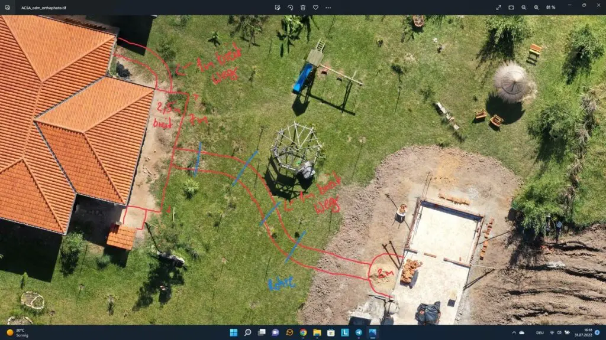
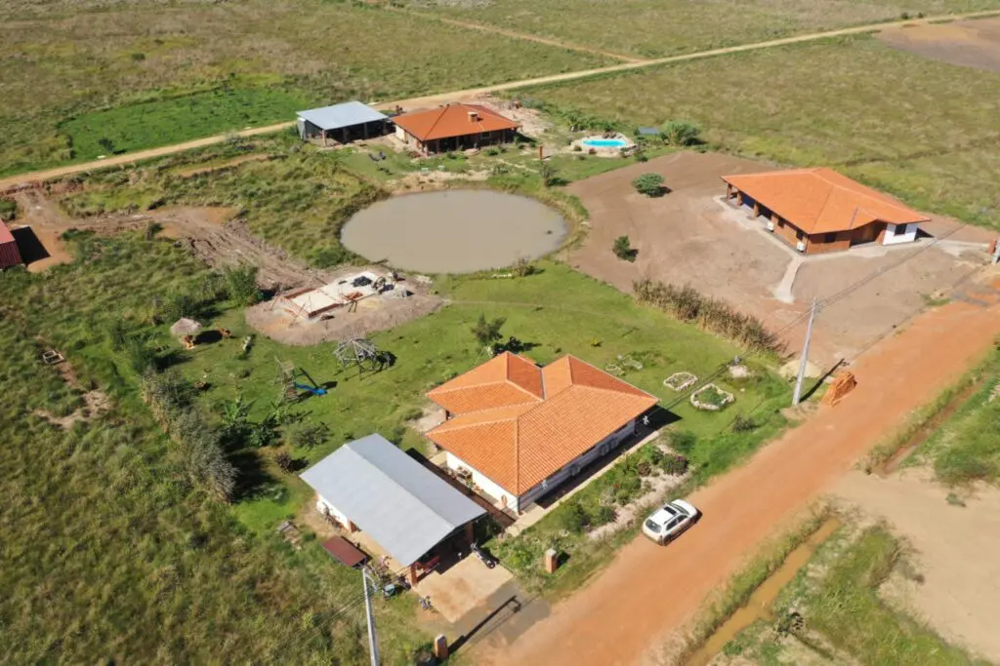

+++
title = 'Our Quincho is being built'
summary = 'Construction began some time ago, and the structure is almost complete. First, a compacted mud platform was created to provide a solid foundation for our Quincho.'
date = 2022-08-18T17:34:14-03:00
lastmod = 2022-08-18T17:34:14-03:00

tags = ['El Paraiso Verde', 'Quincho', 'Pain Therapy', 'Simple Life', 'Emigrate', 'Garden']
categories = ['Paraguay']

showComments = true
chatId = "quinchounderconstruction"

[translation]
  tool = "md-translator"
  version = "1.2.3"
  from = "de"
  to = "en"
  date = 2026-06-21
  time = "19:06:00"
+++

## The treatment room and our outdoor kitchen

The construction work began some time ago, and the room is almost finished. First, a compacted clay platform was created to provide a solid foundation for our “quincho” (a traditional Latin American shelter). On top of that, a reinforced concrete slab was poured. Shortly thereafter, the masons started their work; they are currently building the treatment room for Stefanie.

The structure will later include a glass sliding door and a sliding window. On the other side, as well as at the end of the concrete slab, two columns made of decorative bricks will be installed. These columns will serve as a foundation for the roof construction. We will also build our own outdoor kitchen, which will have a chimney that will protrude through the roof. The roof will be covered with straw, giving us a beautiful thatched roof that matches the appearance of the seating area behind it.






## Our garden in Paraguay is growing

We continue to take care of our garden. The grass is getting thicker every day; the trees are growing at their own pace, and occasionally new trees are added. Once the quincho is finished, we will also plant trees and shrubs around the building. We also plan to extend the terrace and build a new path from the house to the quincho using natural stones. The construction work is expected to begin in about two weeks. We want to decorate the edges of the path with shrubs and install some ambient lighting in certain areas as well.

We’ve mostly bought the lamps for the quincho, and they’re just waiting to be installed. We also planted two pine trees; maybe we can decorate them with a string of lights later on? The children will definitely love that. In the meantime, we’re harvesting a lot of chili peppers, some paprika, tomatoes, and strawberries—all in the Paraguayan winter. I’d like to plant some willows as well and use them to build raised beds and fences later on. Maybe I’ll build the raised beds out of bamboo first; we’ll see. Anyway, we want to have several raised beds. We’ve already built two of them using natural stones.

## The next projects are already planned

I would like to extend our carport on the side, at least the part with the roof. This would allow all our vehicles to be protected under the roof. With the motorcycle cargo carrier and the trailer, things have become a bit cramped, and I also want to be able to store our boat on the trailer without it being constantly exposed to the sun. This would make our carport neater and more organized, as I also use that space quite often for building furniture.

So, I will ask shortly whether someone can build it for me. Otherwise, I still have a plan for a chicken coop; I will prepare a list of materials and order the appropriate wood for it. Once I have the materials here, the chicken coop can be built. We will probably start with 4 to 6 chickens. This will also be very interesting for our children, and most of all, we will have our own chicken eggs.

I had another idea recently while planning the new path. A whirlpool would definitely look great on the extended terrace area. Let’s see if this will ever become a reality.

## More videos on YouTube?

I really want to make a lot more videos about our life in this “green paradise.” I need to figure out a way to balance my schedule so I can make time for this. I have certain expectations for the future videos, but they shouldn’t be too perfect either—otherwise, as experience has shown, nothing will ever get done. Unfortunately, I neglected all of this in the past; otherwise, we would now have a really nice documentary covering the entire period from then to now.

That would definitely be very interesting. I’ve made a few short video clips, but mostly taken more photos. I need to see if I can put together a video that effectively shows the differences between today and back then. So much has changed over the past few years; many new houses have been built in our neighborhood. It might also be interesting to do a tour of the construction sites and show the current progress. Maybe I’ll manage to combine all that into one video; I’ll let my mind wander for some ideas.






## Furniture also runs alongside

Recently, I’ve done some more renovations to our kitchen. We’re still waiting for an offer for the marble so that we can replace the temporary wooden worktop. Other than that, I’ve finished building all the drawers; now all that’s left are the fronts and doors, which I really want to make look nice. I also need to build more drawers for our bedroom, as well as all the corresponding fronts and doors. For our three-wheeled cart, I’ve already made a wooden box; all that’s left is to attach the lid with its hinges. Additionally, we have a storage box with seating space for the cargo area.

Yesterday and today, I cut out the pieces for a hanging cabinet and even started sanding them. Next week, I plan to assemble these parts. More pieces for our shoe cabinet have also been cut out, but there are still a few missing; I will mostly make up for those missing parts using scraps of wood.

By the way, I used some of the remaining materials to build a small wall shelf for the workshop. It seems I really can’t get enough of working in the woodshop! As soon as I have time, I also want to finally use my CNC router. But first, I need to assemble the router myself and build a suitable table for it. All of that will come my way over time.

For now, I’m taking a break from updating this project. It’s going to rain tonight, but tomorrow the weather is supposed to be dry again. Then I’ll continue working on the cabinet that will eventually hang on a wall in our house. See you soon!

Best regards,  
Sebastian


